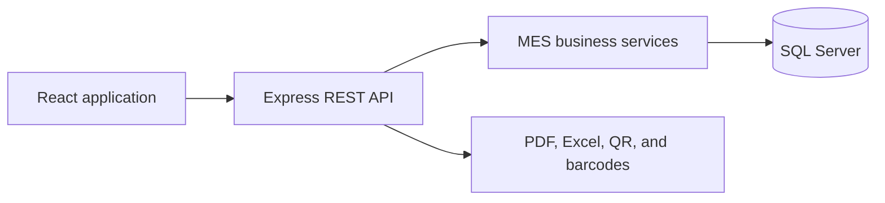
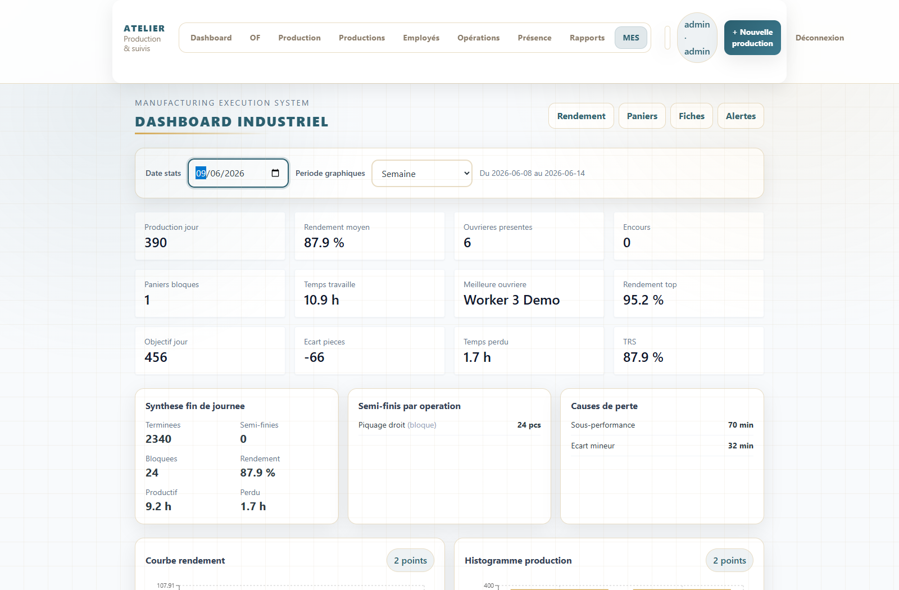
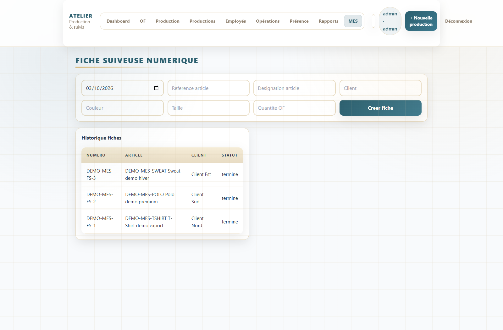
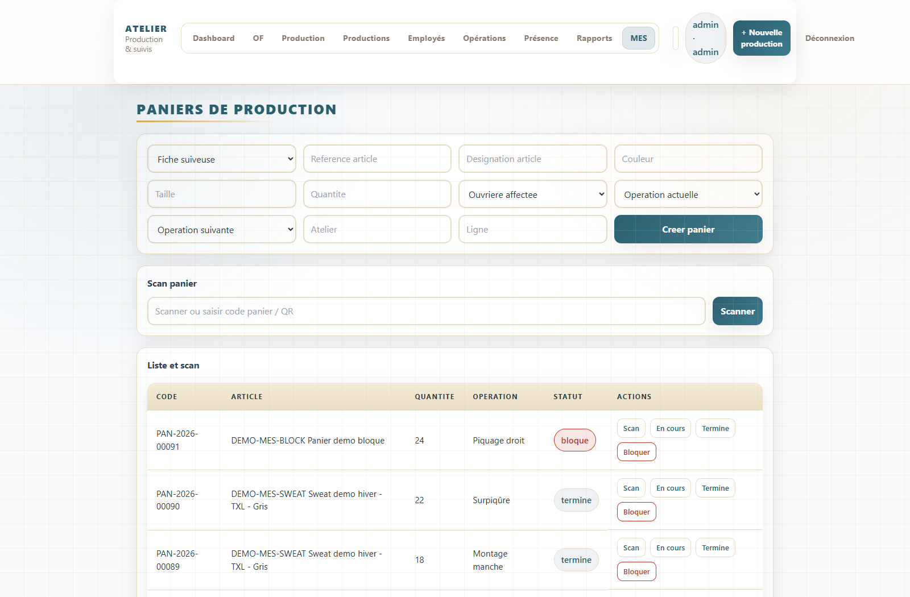

# Production Atelier

[](https://github.com/KhaledZouari/production-atelier/actions/workflows/ci.yml)
[](LICENSE)

A full-stack production management platform for textile workshops. It combines
operational workflows with a Manufacturing Execution System (MES) layer for
real-time tracking, performance measurement, and item traceability.

## Features

- Employee, operation, production, attendance, and order management
- MES performance metrics and operational dashboards
- Item tracking through QR codes and barcodes
- Production documents and Excel/PDF exports
- Alerts, work-in-progress monitoring, and traceability history
- Swagger/OpenAPI documentation

## Stack

| Layer | Technology |
| --- | --- |
| Frontend | React, Vite, Tailwind CSS |
| Backend | Node.js, Express |
| Data | SQL Server |
| Tooling | Swagger, Jest, ESLint, GitHub Actions |

## Architecture



The repository contains JavaScript/Node.js and React components; it does not
contain a C#/.NET or Python service.

## Local setup

Prerequisites: Node.js 20, npm, and SQL Server.

```bash
git clone https://github.com/KhaledZouari/production-atelier.git
cd production-atelier/backend
npm install
cp .env.example .env
npm run seed
npm run dev
```

In a second terminal:

```bash
cd production-atelier/frontend
npm install
npm run dev
```

On PowerShell, replace `cp` with `Copy-Item`. Configure `backend/.env` for your
SQL Server instance. Swagger is available at `/api/docs`.

## Verification

```bash
cd backend && npm run lint && npm test
cd ../frontend && npm run lint && npm run build
```

Backend tests cover MES performance, worked-time, variance, and numeric edge-
case calculations. CI repeats the checks with Node.js 20.

## Engineering decisions

- Business calculations are isolated from HTTP controllers.
- Repositories centralize MES queries.
- Configuration and secrets stay outside the repository.
- Screenshots must use fictional or anonymized production data.

## Business context and engineering approach

### Textile workshop execution

A supervisor needs to connect manufacturing orders, employee activity and item
traceability. This application brings those workflows into a React interface
backed by an Express API and SQL Server. Its MES services calculate efficiency
and track baskets and production sheets.

Business calculations belong in services rather than UI components. Repository-
level SQL access separates persistence from HTTP handling; JWT authentication
gates the operational screens.

## Application screenshots

Captured from the running application on 3 October 2026.

### MES overview



Workshop indicators and operational monitoring.

### Production traceability



Tracking sheets connect orders, operations and production flow.

### Basket tracking



Basket status and quantities support work-in-progress supervision.

### Capture environment

The demonstration uses a separate local SQL Server database, six fictional
workers, three tracking sheets and 91 baskets. The MES seed contains activity
dated 9 June 2026; that date is selected in the dashboard. Local capture access
used a Windows ODBC adapter; the repository setup documents its SQL-login
connection configuration.

The frontend now includes the missing PostCSS configuration so Vite processes
the existing Tailwind directives and layout utilities. Lint completed with zero
errors and five existing warnings; the production build succeeded.

## Evidence and current scope

Efficiency values are demonstration calculations; the TRS label is not evidence
of a validated standard OEE calculation. Screenshots are local demonstration
runs, not evidence of production deployment, factory productivity gains or a
complete security audit.

## License

Distributed under the MIT License. See [LICENSE](LICENSE).
