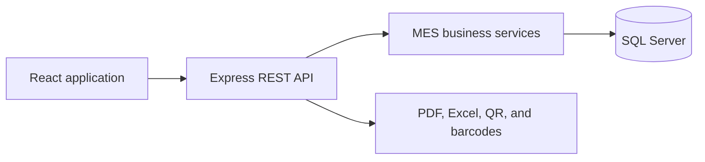

# Production Atelier

[](https://github.com/KhaledZouari/production-atelier/actions/workflows/ci.yml)
[](LICENSE)

A full-stack production management platform for textile workshops. It combines
operational workflows with a Manufacturing Execution System (MES) layer for
real-time tracking, performance measurement, and item traceability.

## Features

- Employee, operation, production, attendance, and order management
- MES performance metrics and operational dashboards
- Item tracking through QR codes and barcodes
- Production documents and Excel/PDF exports
- Alerts, work-in-progress monitoring, and traceability history
- Swagger/OpenAPI documentation

## Stack

| Layer | Technology |
| --- | --- |
| Frontend | React, Vite, Tailwind CSS |
| Backend | Node.js, Express |
| Data | SQL Server |
| Tooling | Swagger, Jest, ESLint, GitHub Actions |

## Architecture



The repository contains JavaScript/Node.js and React components; it does not
contain a C#/.NET or Python service.

## Local setup

Prerequisites: Node.js 20, npm, and SQL Server.

```bash
git clone https://github.com/KhaledZouari/production-atelier.git
cd production-atelier/backend
npm install
cp .env.example .env
npm run seed
npm run dev
```

In a second terminal:

```bash
cd production-atelier/frontend
npm install
npm run dev
```

On PowerShell, replace `cp` with `Copy-Item`. Configure `backend/.env` for
your SQL Server instance. Swagger is available at `/api/docs`.

## Verification

```bash
cd backend && npm run lint && npm test
cd ../frontend && npm run lint && npm run build
```

Backend tests cover MES performance, worked-time, variance, and numeric
edge-case calculations. CI repeats the checks with Node.js 20.

## Engineering decisions

- Business calculations are isolated from HTTP controllers.
- Repositories centralize MES queries.
- Configuration and secrets stay outside the repository.
- Screenshots must use fictional or anonymized production data.

## License

Distributed under the MIT License. See [LICENSE](LICENSE).

