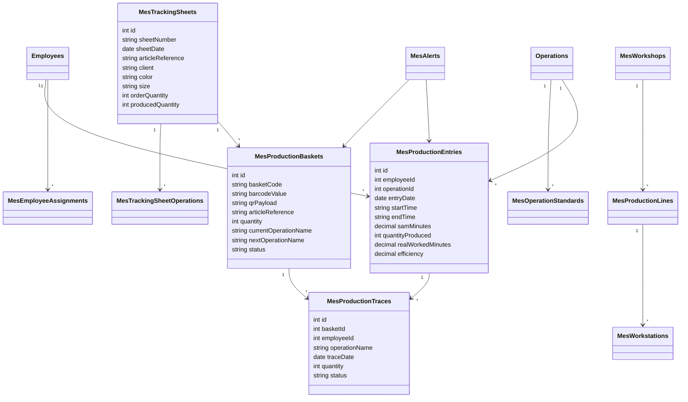

# Module MES Textile / Confection

## Objectif

Ce module ajoute une couche MES modulaire sans modifier les modules existants. Toutes les nouvelles routes sont exposees sous `/api/mes`.

## Tables

- `MesWorkshops`: ateliers.
- `MesProductionLines`: lignes ou chaines de production.
- `MesWorkstations`: postes de travail.
- `MesEmployeeAssignments`: affectation ouvriere / atelier / ligne / poste.
- `MesOperationStandards`: SAM par operation, article, couleur et taille.
- `MesProductionEntries`: saisies de production et rendement individuel.
- `MesTrackingSheets`: fiches suiveuses numeriques.
- `MesTrackingSheetOperations`: operations tracees dans une fiche suiveuse.
- `MesProductionBaskets`: paniers de production avec code `PAN-YYYY-XXXXX`.
- `MesProductionTraces`: historique industriel complet.
- `MesAlerts`: alertes automatiques.
- `MesBarcodeSequences`: sequence annuelle des paniers.

## Formule Rendement

```text
Rendement individuel (%) =
(Quantite Produite x SAM minutes) / Temps Reel Travaille minutes x 100
```

## UML



## API Principale

```text
GET    /api/mes/dashboard/kpis
GET    /api/mes/dashboard/charts

POST   /api/mes/efficiency/individual
GET    /api/mes/efficiency/individual
GET    /api/mes/efficiency/individual/:employeeId/history
GET    /api/mes/efficiency/collective
GET    /api/mes/efficiency/ranking/:groupBy

POST   /api/mes/tracking-sheets
GET    /api/mes/tracking-sheets
GET    /api/mes/tracking-sheets/:id
POST   /api/mes/tracking-sheets/:id/operations

POST   /api/mes/baskets
GET    /api/mes/baskets
GET    /api/mes/baskets/:id
GET    /api/mes/baskets/scan/:code
PATCH  /api/mes/baskets/:id/status
POST   /api/mes/baskets/:id/move
GET    /api/mes/baskets/:code/qr
GET    /api/mes/baskets/:code/barcode

GET    /api/mes/traces
GET    /api/mes/traces/basket/:basketId

GET    /api/mes/alerts
POST   /api/mes/alerts/evaluate
PATCH  /api/mes/alerts/:id/ack
```
